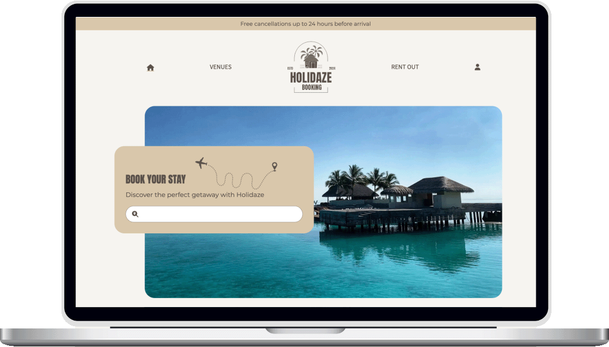

# Project Exam 2 - Holidaze Booking Website



**Holidaze** is a holiday venue booking website built using **React**, **Vite**, and **Tailwind CSS**. The platform allows users to search for, book, and manage holiday stays across various destinations. The project showcases user profiles, venue details, and booking management for both customers and venue managers..

## Features

- **User Profiles**: Users can create and manage their profiles, including uploading an avatar, bio, and managing bookings.
- **Venue Listings**: View available venues with detailed information such as location, rating, and photos.
- **Booking Management**: Customers can book venues, and venue managers can manage bookings.
- **Search Functionality**: A search bar allows users to filter available venues by different criteria.
- **Responsive Design**: The website is fully responsive and optimized for both desktop and mobile devices.


## Technologies Used

- **Frontend**: React, Vite
- **Styling**: Tailwind CSS
- **Icons**: Font Awesome
- **Routing**: React Router
- **Form Handling**: React Hook Form, Yup (for validation)

## Getting Started

### Installing

1. Clone the repo:

```bash
git clone git@github.com:NoroffFEU/portfolio-1-example.git
```

2. Install the dependencies:

```
npm install
```

## Installation

1. Clone the repository:

```bash
git clone https://github.com/your-username/project-exam-2.git
```

2. Navigate to the project directory:

```bash
cd project-exam-2
```

3 Install the dependencies:

```bash
npm install
```

4. Run the development server:

```bash
npm run dev
```

## Contact

[My LinkedIn page](https://www.linkedin.com/in/aashild-l-rasmussen/)

